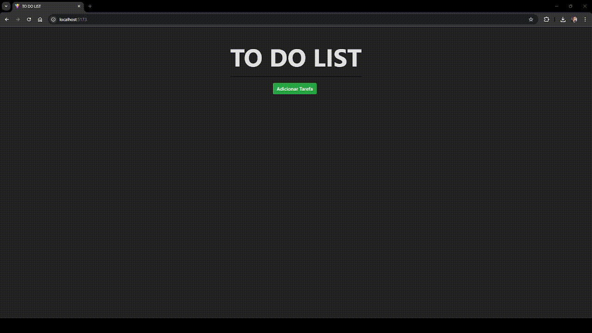

# Tutorial: Como Executar a API Laravel

Este tutorial irá guiá-lo pelos passos necessários para configurar e executar uma API construída com Laravel e, posteriormente, consumir essa API com um aplicativo Vue.js.

## Pré-requisitos

Antes de começar, você precisará ter as seguintes ferramentas instaladas em seu computador:

1. **PHP**: A versão recomendada é a 8.x ou superior.
2. **Composer**: Um gerenciador de dependências para PHP.
3. **MySQL**: Um sistema de gerenciamento de banco de dados. (deixe-o em execução)
4. **Laravel**: O framework PHP (opcional, pois será instalado com o Composer).
5. **Node.js** e **npm**: Necessários para executar o front-end.

## Passo 1: Clone o Repositório

Primeiro, clone o repositório da API. Abra o terminal e execute o seguinte comando na pasta desejada:

```bash
git clone https://github.com/otilianojunior/to-do-list
```

## Passo 2: Instale as Dependências

No diretório da API  **`to-do-list`**, execute o seguinte comando para instalar as dependências necessárias:

```bash
cd api
```
E em seguida:

```bash
composer install
```

Isso instalará todas as bibliotecas e dependências definidas no arquivo `composer.json`.

## Passo 3: Configure o Ambiente

1. **Copie o arquivo `.env.example` para um novo arquivo chamado `.env`:**

   ```bash
   cp .env.example .env
   ```

2. **Abra o arquivo `.env` e configure as variáveis de ambiente:**

   - Configure as credenciais do banco de dados:
     ```env
     DB_CONNECTION=mysql
     DB_HOST=127.0.0.1
     DB_PORT=3306
     DB_DATABASE=nome_do_banco
     DB_USERNAME=seu_usuario
     DB_PASSWORD=sua_senha
     ```

## Passo 4: Gere a Chave da Aplicação

Execute o seguinte comando para gerar a chave da aplicação:

```bash
php artisan key:generate
```

Isso gerará uma chave única que será utilizada para a criptografia.

## Passo 5: Migre o Banco de Dados

Agora, crie as tabelas necessárias no banco de dados. Execute o comando de migração:

```bash
php artisan migrate
```

## Passo 6: Inicie o Servidor

Para iniciar o servidor embutido do Laravel, execute:

```bash
php artisan serve
```

Por padrão, isso iniciará a API em `http://localhost:8000`, mas a porta pode ser alterada conforme a configuração do seu ambiente.

## Passo 7: Teste a API

Agora você pode testar a API usando uma ferramenta como Postman ou Insomnia. Verifique se as rotas estão funcionando corretamente acessando os seguintes endpoints:

- **Registrar Usuário**: `POST http://localhost:8000/api/register`

  Nessa etapa, é necessário passar como parâmetro os seguintes dados no corpo da requisição:
  
  ```json
  {
      "name": "seu_nome",
      "email": "seu_email",
      "password": "sua_senha",
      "c_password": "sua_senha"
  }
  ```

  Não esqueça de sua senha e e-mail, serão necessários para login.

- **Login API**: `POST http://localhost:8000/api/login`

  ```json
  {
      "email": "seu_email",
      "password": "sua_senha",
  }
  ```
  A resposta dessa requisição retornará um `token`, esse é seu Bearer Token, salve ele em bloco de notas de forma temporaria, pois iremos utiliza-lo no próximo passo do tutorial.

## Conclusão

Agora você configurou e executou sua API Laravel com sucesso! Se encontrar problemas, verifique as mensagens de erro no terminal ou no log de erros do Laravel (`storage/logs/laravel.log`).

---

# Tutorial: Como Consumir a API com Vue.js

Nesta etapa, você aprenderá a configurar e executar o front-end do seu aplicativo Vue.js que consome a API Laravel.

## Passo 1: Acesse o Diretório do App

Em um novo terminal, navegue até o diretório do aplicativo Vue.js. Supondo que você já tenha clonado o repositório, e estaja no diretório **`to-do-list`** execute:

```bash
cd app
```

## Passo 2: Instale as Dependências

No diretório do seu aplicativo Vue.js, execute o seguinte comando para instalar as dependências necessárias:

```bash
npm install
```

Isso instalará todas as bibliotecas e dependências definidas no arquivo `package.json`.

## Passo 3: Configure o Ambiente

1. **Crie ou copie o arquivo `.env.example` para um novo arquivo chamado `.env`:**

   ```bash
   cp .env.example .env
   ```

2. **Abra o arquivo `.env` e configure as variáveis de ambiente:** 

   - Verifique se a URL da API está correta:
     ```env
     VUE_APP_API_URL=seu_link_api
     ```
   - Adicione o seu token obtido no `LOGIN` da API:
     ```env
     VUE_APP_API_TOKEN=seu_token
     ```

## Passo 4: Inicie o Servidor de Desenvolvimento

Para iniciar o servidor de desenvolvimento do Vue.js, execute:

```bash
npm run dev
```

Isso iniciará o servidor e você poderá acessar o aplicativo em `http://localhost:3000` ou outra porta que o Vue.js utilizar.

## Passo 5: Teste o Aplicativo

Teste as funcionalidades que consomem a API, como cadastrar, editar, excluir e visualizar tarefas.

## Conclusão

Agora você configurou e executou seu aplicativo Vue.js que consome a API Laravel com sucesso! Se encontrar problemas, verifique as mensagens de erro no terminal ou no console do navegador. Lembre-se de que ambos os servidores devem estar ativos!

## Excução do endpoints

Aqui você pode ver todas as rotas da API em funcionamento.

- **[POST: Register API](assets/images/register-api.png)**  - POST: http://localhost:8000/api/register
- **[POST: Login API](assets/images/login-api.png)** - POST : http://localhost:8000/api/login
- **[POST: Tarefa Create](assets/images/tarefa-create.png)**  - POST: http://localhost:8000/api/tarefas
- **[GET: Tarefas List](assets/images/tarefas-list.png)** - GET: http://localhost:8000/api/tarefas/
- **[GET: Tarefas Show](assets/images/tarefa-show.png)** - SHOW: http://localhost:8000/api/tarefas/{id}
- **[PUT: Tarefa Update](assets/images/tarefa-update.png)** - PUT: http://localhost:8000/api/tarefas/{id}
- **[DEL: Tarefa Delete](assets/images/tarefa-delete.png)**- DELETE: http://localhost:8000/api/tarefas/{id}

Outros imagens importantes:

- **[Banco de Dados](assets/images/api-database.png)**


### Notas
- A API pode ser aprimorada com a inclusão do Swagger para melhor documentar o código.
- O aplicativo pode ser melhorado adicionando telas de login e cadastro, correspondendo a todas as rotas da API.


# Executando

